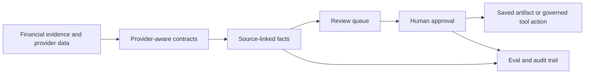

# Agentic Financial AI Patterns

Design notes and example patterns for building financial AI systems that are useful beyond demos.

The focus is not prompt tricks. The focus is behavior architecture: schemas, tool contracts, review queues, approval gates, source grounding, evals, and audit trails.

These are the product and platform patterns that make financial AI systems trustworthy enough to operate.

The hard part is rarely "calling an API." The hard part is making financial data from many providers behave like a coherent product surface: identifiers do not line up, taxonomies disagree, entitlements vary by client and region, point-in-time values change, research and news carry attribution obligations, and source lineage matters when the system starts to reason or act.

## What This Demonstrates

This repository is meant to prove practical architecture judgment:

- source-grounded facts instead of anonymous model prose
- review queues instead of silent persistence
- narrow tool contracts instead of unrestricted automation
- provider-aware data contracts instead of flattened context
- eval and audit trails as product requirements, not afterthoughts

This is the most hands-on artifact set in the profile.

## Flagship Example

- [Advisor Copilot Workflow Example](examples/advisor-copilot-workflow.md): an end-to-end production architecture slice for a source-grounded, tool-using advisor copilot with Pydantic-style contracts, governed tools, eval cases, observability, review gates, and an audit trace.
- [Advisor Copilot Reference Implementation](examples/advisor_copilot_reference.py): a small standard-library Python sketch that runs the workflow, creates review tasks, and emits eval/audit status.

## Patterns



### Source-linked facts

Financial AI systems should not turn evidence into anonymous prose. Extracted facts need provenance.

```json
{
  "fact_type": "liability.balance",
  "label": "Mortgage balance",
  "value": 428500,
  "currency": "USD",
  "as_of_date": "2026-06-30",
  "confidence": 0.82,
  "source": {
    "document_id": "statement-2026-06",
    "page": 2,
    "excerpt": "Principal balance: $428,500"
  },
  "review_status": "needs_advisor_review"
}
```

### Review before persistence

AI-generated facts, assumptions, and narratives should stay provisional until a human approves them.

```text
proposed_fact
  -> review_task
  -> approve | correct | reject
  -> saved_client_artifact
```

### Tool contracts before free-form automation

Trusted financial systems should expose narrow, auditable tools instead of arbitrary shell or browser control.

Prefer:

- `import_files`
- `extract_document_text`
- `extract_pdf_tables`
- `normalize_financial_facts`
- `detect_fact_conflicts`
- `create_review_tasks`
- `draft_snapshot`
- `save_approved_snapshot`

Avoid:

- open-ended shell execution
- unrestricted filesystem reads
- autonomous credentialed login
- unattended financial portal automation

### Uncertainty as product surface

Uncertainty should not be hidden inside a paragraph. It should become a task.

Examples:

- Confirm whether a recurring deposit is payroll or transfer.
- Resolve contradiction between tax return income and paystub income.
- Ask client for missing insurance premium.
- Review low-confidence mortgage balance.

### Precise privacy claims

If an AI API is used, do not claim that no data ever leaves the computer.

Say:

> Persistent records stay local or firm-controlled. AI payloads are minimized, transient, and reviewable.

### Provider-aware data contracts

Financial data products should not hide provider differences too early. A clean product model still needs to preserve enough source context to explain and debug the result.

Useful contracts often include:

- provider and dataset
- original identifier and normalized identifier
- taxonomy or classification source
- entitlement scope
- as-of date and effective date
- point-in-time behavior
- attribution requirement
- lineage back to source payload or document
- transformation/version metadata

When AI is layered on top, these details stop being back-office concerns. They become part of the trust model.

## Why These Patterns Matter

Financial AI lives inside regulated, high-trust workflows. The important question is not whether a model can generate a plausible answer.

The important question is whether the system can show:

- where the answer came from
- how confident it is
- what changed
- who approved it
- what should happen next

These are the questions that separate a convincing AI demo from a product architecture a financial institution can actually trust.

## Current Artifacts And Next Extensions

Current artifacts:

- advisor copilot workflow architecture slice
- runnable advisor copilot reference sketch
- production-readiness eval cases
- example audit trace for a tool-using agent workflow
- source-linked fact schema examples
- advisor review task schema
- provider-aware data contract schema
- governed financial AI tool-contract examples

Useful next extensions:

- sample review-queue lifecycle events
- source-grounding test cases
- entitlement-aware retrieval examples

## Concrete Artifacts

- [Advisor copilot workflow example](examples/advisor-copilot-workflow.md)
- [Advisor copilot reference implementation](examples/advisor_copilot_reference.py)
- [Advisor copilot eval cases](examples/advisor-copilot-eval-cases.json)
- [Advisor copilot audit trace](examples/advisor-copilot-audit-trace.json)
- [Source-linked fact schema](schemas/source-linked-fact.schema.json)
- [Provider data contract schema](schemas/provider-data-contract.schema.json)
- [Advisor review task schema](schemas/advisor-review-task.schema.json)
- [Governed financial AI tool contracts](examples/tool-contracts.md)

## Who This Is For

Relevant for teams building production AI systems that need to connect models to financial data, governed tools, review workflows, evals, observability, structured output validation, and auditability.

## Use / Reuse

Content is licensed under [CC BY-NC 4.0](LICENSE): you may share and adapt it for noncommercial purposes with attribution. Commercial use requires permission.
