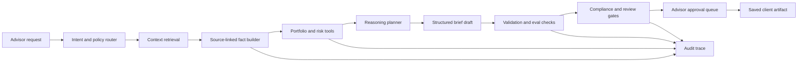

# Advisor Copilot Workflow Example

This example shows how I would structure a production-grade advisor copilot workflow for a wealthtech or enterprise financial AI platform.

The goal is not to let an agent write confident prose from loose context. The goal is to make each step reviewable: retrieval, source grounding, reasoning, tool use, validation, compliance checks, advisor approval, and audit trail.

## Scenario

An advisor asks:

> Prepare a client-ready meeting brief for a household with concentrated single-stock exposure, recent cash inflows, and incomplete held-away account data.

The system should produce a reviewed meeting brief only after it can show:

- which client facts were retrieved
- which source records support those facts
- what assumptions are still provisional
- which tools were invoked
- which compliance checks ran
- which advisor review tasks remain
- why the output is safe to save or send

## Architecture Slice



## Agent Responsibilities

| Agent | Responsibility | Must not do |
| --- | --- | --- |
| Intent router | Classify request, risk level, required tools, and output type | Execute portfolio tools or draft client-facing advice |
| Retrieval agent | Gather entitled client, portfolio, research, and planning context | Hide missing source coverage |
| Fact agent | Normalize source-linked facts with confidence and provenance | Persist facts without review status |
| Analysis agent | Use governed tools for exposure, concentration, risk, and scenario checks | Invent calculations outside approved tools |
| Briefing agent | Draft a structured advisor brief from approved or reviewable facts | Send client-ready output directly |
| Compliance agent | Run policy checks, prohibited-language checks, and disclosure requirements | Overrule required human approval |
| Evaluation agent | Score groundedness, financial correctness, completeness, and policy adherence | Treat model confidence as evidence |

## Pydantic-Style Contracts

```python
from datetime import date
from typing import Literal

from pydantic import BaseModel, Field


class SourceReference(BaseModel):
    provider: str
    dataset: str
    source_id: str
    as_of_date: date
    entitlement_scope: str
    excerpt: str | None = None


class AdvisorCopilotFact(BaseModel):
    fact_id: str
    fact_type: Literal[
        "portfolio.concentration",
        "cashflow.deposit",
        "held_away.missing_data",
        "risk.scenario",
        "planning.question",
    ]
    label: str
    value: str | float | int | bool
    confidence: float = Field(ge=0, le=1)
    source_refs: list[SourceReference]
    review_status: Literal["approved", "needs_review", "rejected"]


class ToolInvocation(BaseModel):
    tool_name: str
    input_contract_version: str
    output_contract_version: str
    purpose: str
    source_fact_ids: list[str]
    status: Literal["succeeded", "failed", "blocked"]
    latency_ms: int
    cost_estimate_usd: float


class CopilotReviewTask(BaseModel):
    task_id: str
    severity: Literal["low", "medium", "high"]
    reason: str
    related_fact_ids: list[str]
    required_reviewer: Literal["advisor", "compliance", "operations"]
    blocks_client_ready_output: bool
```

## Governed Tool Registry

The copilot can call only narrow tools with explicit contracts.

| Tool | Purpose | Guardrail |
| --- | --- | --- |
| `retrieve_entitled_client_context` | Pull household, account, objective, and meeting context | Must enforce entitlement scope and log source coverage |
| `normalize_source_linked_facts` | Convert retrieved records into typed facts | Must preserve provider, dataset, source id, and as-of date |
| `analyze_concentration_exposure` | Calculate issuer, sector, and account-level concentration | Must use deterministic portfolio engine |
| `run_risk_scenario` | Estimate scenario impact for approved holdings | Must cite model version and assumptions |
| `detect_missing_held_away_data` | Identify incomplete client facts | Must create review tasks instead of guessing |
| `draft_advisor_brief` | Draft a structured brief for advisor review | Must include citations and unresolved review tasks |
| `save_approved_brief` | Persist final artifact | Requires advisor approval and passing eval/compliance checks |

## Example Audit Trace

```json
{
  "run_id": "advisor-copilot-run-001",
  "request_type": "meeting_brief",
  "risk_level": "medium",
  "retrieval": {
    "entitlement_scope": "advisor_household_book",
    "sources_checked": [
      "portfolio_positions",
      "client_profile",
      "recent_cashflows",
      "meeting_notes",
      "held_away_uploads"
    ],
    "missing_sources": [
      "held_away_401k_statement"
    ]
  },
  "tool_invocations": [
    {
      "tool_name": "analyze_concentration_exposure",
      "status": "succeeded",
      "latency_ms": 842,
      "source_fact_ids": [
        "fact-position-aapl-001",
        "fact-position-msft-001"
      ]
    },
    {
      "tool_name": "detect_missing_held_away_data",
      "status": "succeeded",
      "latency_ms": 219,
      "source_fact_ids": [
        "fact-client-held-away-001"
      ]
    }
  ],
  "eval_results": {
    "groundedness": "pass",
    "financial_correctness": "pass",
    "policy_adherence": "pass",
    "client_ready_without_review": "fail"
  },
  "review_tasks_created": [
    "review-held-away-401k",
    "review-cashflow-source"
  ],
  "final_status": "advisor_review_required"
}
```

## Evaluation Cases

| Eval | Pass condition | Failure mode caught |
| --- | --- | --- |
| Groundedness | Every material claim links to an entitled source reference | Hallucinated client fact |
| Financial correctness | Calculations match deterministic tool output within tolerance | Model-invented math |
| Completeness | Missing held-away data becomes a review task | Silent assumption |
| Compliance language | Draft avoids prohibited advice language and missing disclosures | Unsafe client-ready wording |
| Review gating | Unapproved facts block save/send actions | Unattended automation |
| Observability | Run logs include tool latency, status, source ids, and eval results | Untraceable failure |

## Production Concerns

This pattern should be implemented with boring reliability:

- typed schemas for every agent boundary
- idempotent tool calls where possible
- durable state for long-running review workflows
- evals for groundedness, financial correctness, and policy adherence
- trace ids across retrieval, tool calls, model calls, validation, review, and persistence
- latency and cost budgets per workflow stage
- explicit fallback behavior when retrieval, tools, or evals fail
- human approval for client-ready or persistent artifacts

## Why This Matters

Financial institutions do not need an agent that merely sounds smart. They need systems that can reason over financial data, call tools, produce structured outputs, expose uncertainty, pass evals, and leave a defensible record.

That is the difference between a demo copilot and a production advisor workflow.
